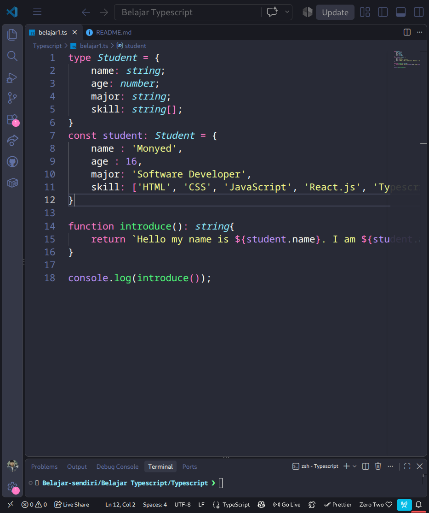

# 🚀 Belajar TypeScript Biar Gak Kena `undefined is not a function`

Selamat datang di repository tempat aing mempertaruhkan sisa-sisa kesehatan mental demi memahami **TypeScript**! Katanya sih pakai TS bikin hidup lebih tenang dan tentram, tapi pas baru mulai malah bikin pusing gara-gara garis merah di mana-mana kayak buku tabungan minus 🫠.

---

## 📸 Foto Waktu Aing Belajar TS Pertama Kali

Ini dia bukti sejarah pas pertama kali ngetik kodingan TypeScript. Namanya aja `Monyed`, tapi cita-citanya jadi *Software Developer* handal 🐒💻:

---

## 👤 Siapa Aing?

Dibuat dengan penuh rasa penasaran dan sedikit emosi oleh:

* 🐱‍‍💻 [@Fawwaz](https://www.github.com/Asyamfaw)

---

## 🎭 Char Favorit Guwah

Sambil ngoding TypeScript biar gak tantrum, wajib didampingi oleh waifu/char favorit sepanjang masa biar *productivity* naik 300%:

---

## ⚠️ Catatan Penting & Disclaimer (Sangat Nyeleneh)

> 1. **Filosofi TS:** *"Ngoding JavaScript itu kayak naik motor gak pakai helm, bebas tapi bahaya. Ngoding TypeScript itu kayak naik motor dituntun Polantas... aman sih, tapi dikit-dikit dipritt 'ANY TYPE NOT ALLOWED!!' 🚨"*
>
> 2. **Kondisi Otak:** Jika kodingan ini tiba-tiba error `Type 'string' is not assignable to type 'number'`, harap maklum. Itu tanda bahwa otak pembuatnya sedang menguji batas kesabaran kompiler TS.
>
> 3. **Efek Samping:** Belajar TypeScript dapat menyebabkan kebiasaan menterjemahkan semua benda mati di dunia nyata menjadi `interface` dan `type`.
>
> 4. **Jaminan Kualitas:** Kodingan di repo ini 100% diproduksi menggunakan energi Kopi + Zero Two power. Kalau ada bug, itu bukan bug... tapi fitur rahasia yang sengaja dibuat untuk melatih mental penilai. 🗿
>
> 5. **Hal Terpenting**

